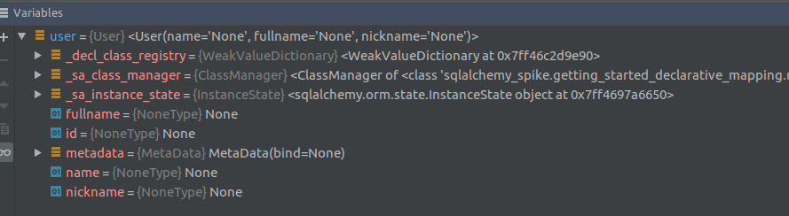
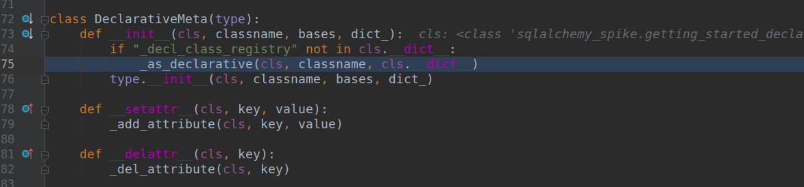

# Spike - Clean Architecture with SQLAlchemy

*This spike is a draft*

[](https://travis-ci.org/FabienArcellier/spike-clean-architecture-with-sqlalchemy)

An ORM is a complex beast that frequently take control of the application
to make programming exercice more productive. SQLAlchemy take the same road and
offer consistent approache to manipulate database abstraction with the minimum of code.

If the code base grows doing only `CRUD operations` on database resource, this approach
is working well. In many software that's the case.

If your software start to implement business rule and use SQLAlchemy entity to communicate
through the differents layers, you may start to have bad surprise :

* entity sometimes are linked to the database, sometimes they aren't
* entity can not be serialized easily due to the way an ORM is working (lazy loading, ...)
* reuse entity for other work introduce coupling with database structure
* layers architecture doesn't work well as the SQLAlchemy entity maintains the link with the database

The goal of this repository is to understand through experimentation how to build clean architecture with sql alchemy :

* How SQLAlchemy build [orm entity instance](https://docs.sqlalchemy.org/en/13/orm/tutorial.html#declare-a-mapping) and make the code lie for your own good
* How to declare SQLAlchemy model in way compatible with Clean Architecture
* How to isolate `domain entity` from `sqlalchemy entity` without writing the code twice

## More about SQLAlchemy

SQLAlchemy provides a full suite of well known enterprise-level persistence patterns, 
designed for efficient and high-performing database access, adapted into a simple 
and Pythonic domain language.

* [sql alchemy](https://www.sqlalchemy.org/)
* [Architecture of Open Source Applications - SQLAlchemy](http://aosabook.org/en/sqlalchemy.html)

## More about Clean Architecture

Clean Architecture is a collection of patterns and design rules
collected and described by **R. C. Martin** in the book **Clean Architecture** 
to improve software structure and design.


* Robert C. Martin, Clean architecture: a craftsman’s guide to software structure and design. London, England: Prentice Hall, 2018.

The philosophy of the clean architecture is to work with a core with a high level of abstraction and
to contains complexity in external layer using isolated components.

## The latest version

You can find the latest version to ...

```bash
git clone https://github.com/FabienArcellier/spike-clean-architecture-with-sqlalchemy.git
```

## Getting started

### 1. Create a simple CRUD with SQLAlchemy

* [getting_started_declarative_mapping](sqlalchemy_spike/getting_started_declarative_mapping)

On this implementation, I go straight forward and use Declarative mapping.
An object instanciate with a declarative mapping almost looks like a 
plain python object.



If it was a plain python object, the code should be able to serialize a `SQLAlchemy entity`. 
It's not. The code in [`getting_started_no_serialization.py`](sqlalchemy_spike/getting_started_declarative_mapping/getting_started_no_serialization.py) will 
fail to serialize an instance of the user at the end of the treatment.

```python
print(json.dumps(ed_user))
```

You should get the following error when you are running the exemple.

```text
Traceback (most recent call last):
  File "/home/far/documents/spikes/20200509_1219__clean-architecture-with-sqlalchemy/sqlalchemy_spike/getting_started_declarative_mapping/getting_started.py", line 34, in <module>
    main()
  File "/home/far/documents/spikes/20200509_1219__clean-architecture-with-sqlalchemy/sqlalchemy_spike/getting_started_declarative_mapping/getting_started.py", line 30, in main
    print(json.dumps(ed_user))
  File "/usr/lib/python3.7/json/__init__.py", line 231, in dumps
    return _default_encoder.encode(obj)
  File "/usr/lib/python3.7/json/encoder.py", line 199, in encode
    chunks = self.iterencode(o, _one_shot=True)
  File "/usr/lib/python3.7/json/encoder.py", line 257, in iterencode
    return _iterencode(o, 0)
  File "/usr/lib/python3.7/json/encoder.py", line 179, in default
    raise TypeError(f'Object of type {o.__class__.__name__} '
TypeError: Object of type User is not JSON serializable
```

The issue is this sort of smart object can raise side effect in strange condition.

For exemple, when we run the code with python debug, I set a break point on the line 24 : `print(ed_user)`
I get this error message.

```text
sqlite3.ProgrammingError: SQLite objects created in a thread can only be used in 
that same thread. The object was created in thread id 139842150221568 and 
this is thread id 139842281011008.
```

This error message is an illustration than the runtime is doing lot of more than what is
written on the code. That's something we want most of the time.

The implementation of SQLAlchemy is something great. It uses lot of pythonic behaviors as [Python Metaclass](https://www.python.org/dev/peps/pep-3115/) to propose
something very easing to work with. When the code instanciate an object of User type, SQLAlchemy
is doing lot of work behind the door.

A good way to understand what's happen is to use a debugger. I recommand to use `DeclarationMeta`
as a starting point. It the metaclass of `Base` that User inherits.



As a developper, using `SQLAlchemy Entity` outside the database layer may become a pain.
Unfortunately, it's very easy to give back this sort of object as a result and use
it in the API layer. A `SQLAlchemy Entity` look like as a plain python object, it is a valid
datastructure. The fact that is lot of more is visible only if you are using debugger on
the python code.

We can observe in this case if we return a SQLAlchemy entity we expose undesirable 
side effects to the rest of the application.

When we try to maintain the complexity under control, we are assuming once an entity left 
the layer dedicated to a database, it doesn't interact with it anymore.


### 2. Transform a SQLAlchemy Entity into Python plain object


## Developper guideline

```
$ make
activate                       activate the virtualenv associate with this project
coverage                       output the code coverage in htmlcov/index.html
help                           provides cli help for this makefile (default)
install_requirements_dev       install pip requirements for development
install_requirements           install pip requirements based on requirements.txt
lint                           run pylint
tests                          run automatic tests
tests_units                    run only unit tests
tox                            run existing test suite on python 2.7, python 3.6 and python 3.7
update_requirements            update the project dependencies based on setup.py declaration
```

### Install development environment

Use make to instanciate a python virtual environment in ./venv and install the
python dependencies.

```bash
make install_requirements_dev
```

### Install production environment

```bash
make install_requirements
```

### Initiate or update the library requirements

If you want to initiate or update all the requirements `install_requires` declared in `setup.py`
and freeze a new `Pipfile.lock`, use this command

```bash
make update_requirements
```

### Activate the python environment

When you setup the requirements, a `venv` directory on python 3 is created.
To activate the venv, you have to execute :

```bash
make venv
source venv/bin/activate
```

### Run the linter and the unit tests

Before commit or send a pull request, you have to execute `pylint` to check the syntax
of your code and run the unit tests to validate the behavior.

```bash
make lint
make tests
```

## Contributors

* Fabien Arcellier

## License

MIT License

Copyright (c) 2018 Fabien Arcellier

Permission is hereby granted, free of charge, to any person obtaining a copy
of this software and associated documentation files (the "Software"), to deal
in the Software without restriction, including without limitation the rights
to use, copy, modify, merge, publish, distribute, sublicense, and/or sell
copies of the Software, and to permit persons to whom the Software is
furnished to do so, subject to the following conditions:

The above copyright notice and this permission notice shall be included in all
copies or substantial portions of the Software.

THE SOFTWARE IS PROVIDED "AS IS", WITHOUT WARRANTY OF ANY KIND, EXPRESS OR
IMPLIED, INCLUDING BUT NOT LIMITED TO THE WARRANTIES OF MERCHANTABILITY,
FITNESS FOR A PARTICULAR PURPOSE AND NONINFRINGEMENT. IN NO EVENT SHALL THE
AUTHORS OR COPYRIGHT HOLDERS BE LIABLE FOR ANY CLAIM, DAMAGES OR OTHER
LIABILITY, WHETHER IN AN ACTION OF CONTRACT, TORT OR OTHERWISE, ARISING FROM,
OUT OF OR IN CONNECTION WITH THE SOFTWARE OR THE USE OR OTHER DEALINGS IN THE
SOFTWARE.
